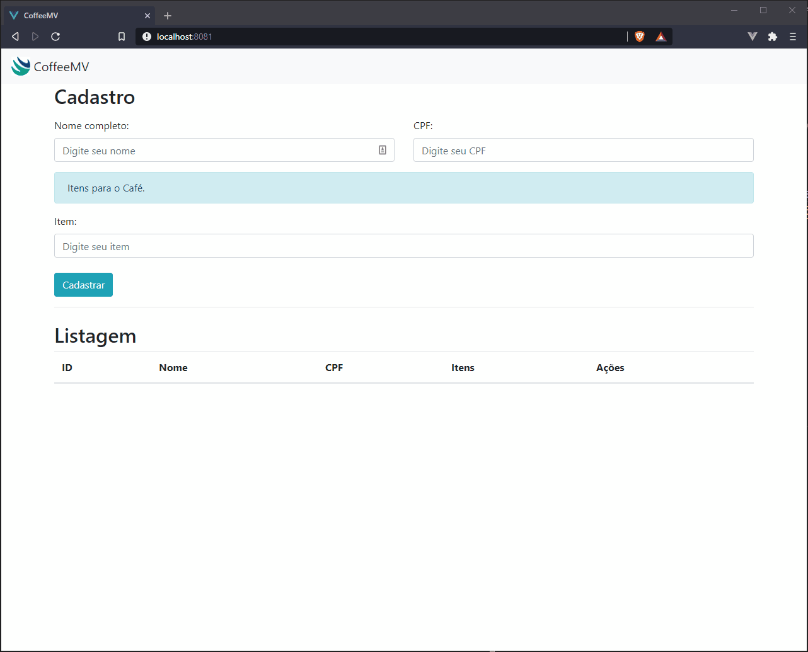

    <h1>Desafio - CoffeeMV</h1>

    

### :memo: Info
Backend: Desenvolvimento de API Rest em Java utilizando Spring Boot
Frontend: Desenvolvimento da interface visual da aplicação foi desenvolvida com Vue e Bootstrap

> Ao subir a aplicação no Heroku as validações dos campos em branco não funcionam. Ainda estou tentando descobrir a correção.

### :hammer: Tecnologias
<ul>
    <li>Java</li>
    <li>Vue</li>
    <li>Bootstrap</li>
    <li>Heroku</li>
    <li>Postgres</li>
</ul>

